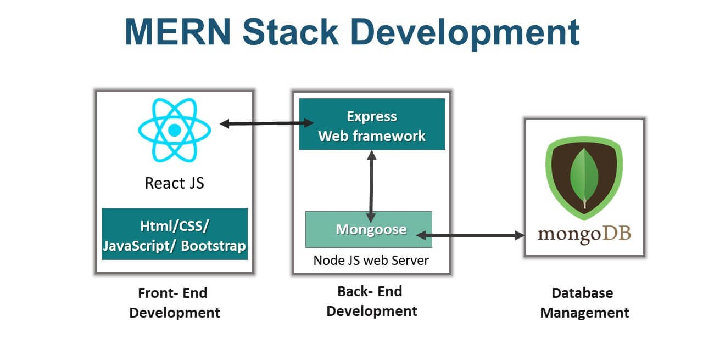

# MERN Stack Notes Application

A full-stack notes application built with the MERN stack (MongoDB, Express.js, React, Node.js) featuring a modern UI with Tailwind CSS and DaisyUI, rate limiting, and real-time notifications.

## 🚀 Features

- **Full CRUD Operations**: Create, read, update, and delete notes
- **Modern UI**: Built with React, Tailwind CSS, and DaisyUI components
- **Rate Limiting**: API protection with Upstash Redis
- **Real-time Notifications**: Toast notifications for user feedback
- **Responsive Design**: Mobile-first responsive interface
- **Fast Development**: Hot reload with Vite and Nodemon
- **Icon Integration**: Lucide React icons for modern UI elements

## 🛠️ Tech Stack

### Frontend
- **React 19** - UI library
- **Vite** - Build tool and dev server
- **Tailwind CSS** - Utility-first CSS framework
- **DaisyUI** - Tailwind CSS components
- **Axios** - HTTP client
- **React Router** - Client-side routing
- **React Hot Toast** - Toast notifications
- **Lucide React** - Icon library

### Backend
- **Node.js** - Runtime environment
- **Express.js** - Web framework
- **MongoDB** - NoSQL database
- **Mongoose** - MongoDB ODM
- **Upstash Redis** - Rate limiting
- **dotenv** - Environment configuration

## 🏗️ System Architecture

The application follows a modern MERN stack architecture with clear separation between frontend and backend services:


*System architecture diagram showing the interaction between React frontend, Express.js backend, MongoDB database, and Redis cache*

The architecture demonstrates:
- **Frontend (React)**: User interface built with modern React components and Tailwind CSS
- **Backend (Express.js)**: RESTful API server handling business logic and data operations
- **Database (MongoDB)**: NoSQL database for persistent data storage
- **Cache (Redis)**: Rate limiting and session management
- **Communication**: HTTP/HTTPS requests between frontend and backend

## 📋 Prerequisites

Before running this application, ensure you have:

- Node.js (v14 or higher)
- MongoDB database (local or MongoDB Atlas)
- Upstash Redis account
- npm or yarn package manager

## 🚀 Quick Start

### 1. Clone the Repository
```bash
git clone <your-repo-url>
cd mern-stack
```

### 2. Backend Setup
```bash
cd Backend
npm install
```

Create a `.env` file in the Backend directory:
```env
PORT=5001
MONGODB_URI=your_mongodb_connection_string
UPSTASH_REDIS_REST_URL=your_upstash_redis_url
UPSTASH_REDIS_REST_TOKEN=your_upstash_redis_token
```

Start the backend server:
```bash
npm run dev
```

### 3. Frontend Setup
```bash
cd ../Frontend
npm install
```

Start the frontend development server:
```bash
npm run dev
```

### 4. Access the Application
- Frontend: `http://localhost:5173`
- Backend API: `http://localhost:5001`

## 📁 Project Structure

```
mern-stack/
├── Backend/
│   ├── src/
│   │   ├── config/          # Database configuration
│   │   ├── controllers/     # Route controllers
│   │   ├── middleware/      # Custom middleware
│   │   ├── models/          # Mongoose models
│   │   ├── routes/          # API routes
│   │   └── server.js        # Main server file
│   ├── package.json
│   └── README.md
├── Frontend/
│   ├── src/
│   │   ├── components/      # React components
│   │   ├── pages/           # Page components
│   │   ├── lib/             # Utility functions
│   │   ├── assets/          # Static assets
│   │   ├── App.jsx          # Main App component
│   │   └── main.jsx         # Entry point
│   ├── public/              # Public assets
│   ├── package.json
│   ├── vite.config.js       # Vite configuration
│   ├── tailwind.config.js   # Tailwind configuration
│   └── README.md
└── README.md                # This file
```

## 🔧 Available Scripts

### Backend
- `npm run dev` - Start development server with nodemon
- `npm start` - Start production server

### Frontend
- `npm run dev` - Start Vite development server
- `npm run build` - Build for production
- `npm run preview` - Preview production build
- `npm run lint` - Run ESLint

## 🌐 API Endpoints

| Method | Endpoint | Description |
|--------|----------|-------------|
| GET | `/api/notes` | Get all notes |
| POST | `/api/notes` | Create a new note |
| GET | `/api/notes/:id` | Get a specific note |
| PUT | `/api/notes/:id` | Update a note |
| DELETE | `/api/notes/:id` | Delete a note |

## 🎨 UI Components

- **Navbar**: Navigation component with branding
- **NoteCard**: Individual note display component
- **NotesNotFound**: Empty state component
- **RateLimitedUI**: Rate limit notification component

## 🔒 Environment Variables

### Backend (.env)
```env
PORT=5001
MONGODB_URI=mongodb://localhost:27017/notes-app
UPSTASH_REDIS_REST_URL=https://your-redis-url
UPSTASH_REDIS_REST_TOKEN=your-redis-token
```

## 🚀 Deployment

### Backend Deployment
1. Set up environment variables on your hosting platform
2. Build and deploy the backend to services like Heroku, Railway, or Vercel

### Frontend Deployment
1. Build the frontend: `npm run build`
2. Deploy the `dist` folder to services like Netlify, Vercel, or GitHub Pages
3. Update API base URL in `Frontend/src/lib/axios.js`

## 🤝 Contributing

1. Fork the repository
2. Create a feature branch: `git checkout -b feature-name`
3. Make your changes
4. Commit your changes: `git commit -m 'Add feature'`
5. Push to the branch: `git push origin feature-name`
6. Submit a pull request

## 📝 License

This project is licensed under the ISC License.

## 🐛 Issues

If you encounter any issues, please create an issue on the GitHub repository.

